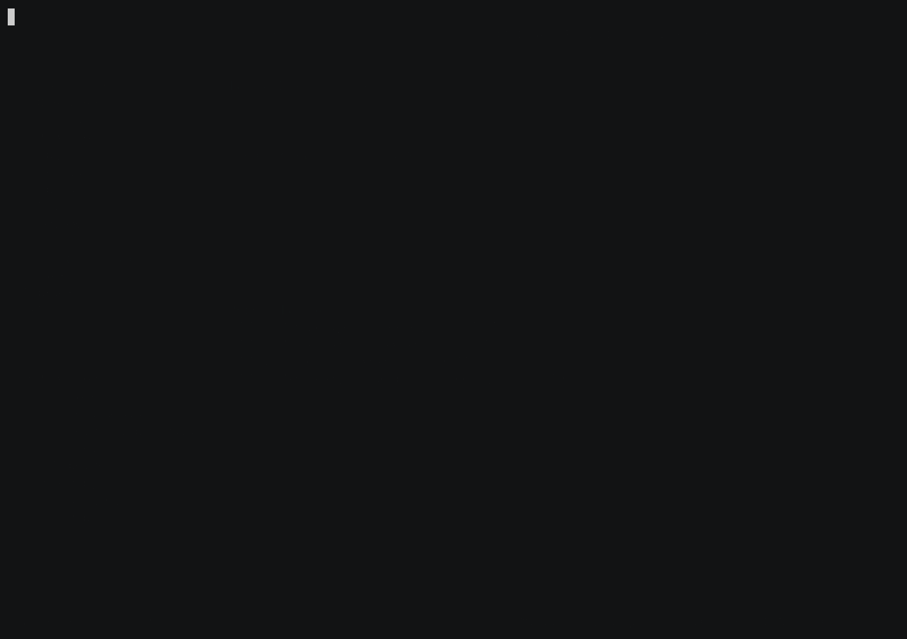

# gala-tui

A functional, Elm-architecture TUI framework written in **GALA** (which transpiles to Go).

Built ground-up around immutability, exhaustive sealed types, and pure-data widgets.
Includes everything you'd expect from a serious TUI library — and several things you wouldn't.



## Features

**Core architecture**
- `Program[M, T]` — Elm-style Model / Update / View triple
- `Cmd[T]` — pure data side effects (NoCmd / QuitCmd / MsgCmd / BatchCmd / **FutureCmd**)
- `Sub[T]` — subscriptions: KeySub / BatchSub / MapSub / **TickSub** (timer)
- `RunRich` / `RunFull` — async-aware runtimes (futures + tickers + mouse + resize + diff render)

**Layout & rendering**
- Constraint solver (Length, Percent, Fill, MinLen, MaxLen, Ratio)
- Flex distribution (Start / End / Center / SpaceBetween / SpaceAround / SpaceEvenly) + inter-child spacing
- Row, Column, Stack, Overlay, Padding, Align (both axes), **Block** (borders with titles, per-side edges, styled frames)
- **Rich text** — `Span` / `Line` / `RichText` for per-run styling within a line
- Differential renderer (`Buffer.DiffString`) — only changed cells go on the wire
- `Buffer.RestyleRegion` — apply a style to a region without touching its glyphs
- Grapheme-aware cell widths (CJK, emoji, combining marks, East-Asian-Ambiguous)

**Widgets**
- Text · Paragraph (word-wrap) · **ParagraphView** (styled runs that survive wrapping, alignment, vertical + horizontal scroll) · Input (focus caret + horizontal scroll, **masked** for passwords, **click to position**) · Button · Spinner
- List (**highlight symbol + scroll padding** via `SelectListView`) · Table · **TableView** (styled cells, footer, multi-line rows, row/column/cell selection) · **DataTable** (sort + filter + frozen header + scrolling) · Tree
- Progress · ProgressLabeled · Gauge · **LineGauge** (one row: caption + rule) · Sparkline · BarChart · **BarChartOf** / **HBarChartOf** (grouped bars, vertical or horizontal, eighth-cell precision) · **LineChart** (sub-cell resolution)
- **Canvas** — shapes in your own coordinate space at 2×4 braille resolution, including filled areas
- **Tabs** · **Menu** · **Dropdown** · **Modal** (ConfirmDialog / AlertDialog) · **Scrollbar** (4 orientations) · **Viewport**
- **Toast** · **StatusBar** · **LogPanel** · **Form** (multi-field with validators)
- **Markdown** rendering (headings, bold, italic, code spans, links, lists, rules)
- **Command palette** with fuzzy search (à la VS Code Cmd-Shift-P)
- Auto-generated **help screen** from key-binding declarations

**Modern terminal integration**
- SGR mouse mode (`\x1b[?1006h`) — clicks, scroll, drag
- **Bracketed paste** — a paste arrives as one event, not N keypresses
- **`PrintAbove`** — put lines in the scrollback above an inline viewport, where they survive the app
- **Focus events** — know when the terminal window gains or loses focus
- **Kitty keyboard protocol** — tells Ctrl+I from Tab, Ctrl+M from Enter, Esc from an escape sequence
- OSC 8 hyperlinks · OSC 52 clipboard · OSC 2 terminal title

**State helpers**
- `ScreenStack` — multi-screen routing with breadcrumbs
- `FocusManager` — pane-cycle ring with Tab/Shift-Tab semantics
- `Animation` — interpolated tweens with 5 easings (Linear, EaseInCubic, EaseOutCubic, EaseInOutCubic, Bounce, StepEasing)
- `Snapshot` testing utilities — render a Widget to a string for golden-file assertions

**Themes**
- Default · Dark · Light · HighContrast (palette + border kind + style overrides)

**Cmd helpers**
- `AfterDelay(d, msg)` · `Async(compute, onResult)` · `AsyncTry(compute, onOk, onErr)`
- `ReadFileCmd(path, …)` · `WriteFileCmd(path, content, …)`

**Key spec DSL**
- `KeyBind[T]("ctrl+c", Quit())` — human-readable shortcut strings, no boilerplate

## Quick demo

```bash
gala build ./demo
./gala_tui.exe
```

The bundled demo is a build-server dashboard across eight screens, and between
them they put every widget on screen at least once:

| Screen | What it shows |
|---|---|
| Overview | sidebar nav, collapsible Tree, grouped BarChartOf, Sparkline, Gauge, Recent Builds |
| Builds | sortable/filterable DataTable behind a Tabs bar |
| Pipelines | the Tree as the main pane, expand/collapse by double-click |
| Logs | LogPanel, also reachable as a drawer over any screen |
| Charts | LineChart, MultiLineChart, a Canvas filled-area series, LineGauge, Gauge, Sparkline |
| Forms | Input and InputMasked with click-to-position, Button, SearchInput, a wrapping ParagraphView |
| Data | SelectList, Dropdown, a TableView (coloured states, totals footer, ▶ cursor) and the Scrollbar that tracks it |
| Review | DiffViewStats, MarkdownView, OSC 8 links, Tags |

Over the top of all of them: the command palette, the confirm modal, toasts,
the help overlay and four themes.

The GIF above is recorded from a committed script — keystrokes *and* mouse
clicks — that visits all eight screens, so it can be regenerated after a UI
change rather than re-shot by hand. Every widget is driven by whichever input
suits it, and the ones that take both are shown taking both: the same list
selection moves under a click and under the arrow keys, and the caret in a
text field lands wherever the pointer does — including inside a masked
password. See [demo/record/README.md](demo/record/README.md).

### Keys

| Key | Action |
|---|---|
| `Ctrl-P` | command palette (fuzzy search) |
| `↑ / ↓` | cycle screens (overview ↔ builds ↔ pipelines ↔ logs); on builds screen, moves the row cursor |
| `PgUp / PgDn` | scroll the log drawer when it's open |
| `End` | jump to the latest log entry |
| `Tab` | cycle focus pane; in the confirm modal, flips Yes ↔ No |
| `Enter` | confirm; in the confirm modal, picks the focused button |
| `Esc` | close overlay / go back |
| `?` | toggle help (markdown overlay) |
| `/` | toggle log drawer |
| `t` | cycle theme (default → dark → light → high-contrast) |
| `c` | copy the selected build row to clipboard |
| `d` | open the deploy-to-prod confirm dialog |
| `q` / `Ctrl-C` | quit |
| Mouse wheel | scroll up/down in the focused list/table |

## Documentation

- [Getting Started](docs/GETTING_STARTED.md) — build a counter, an input form, and a fetcher app from scratch
- [Widget catalog](docs/WIDGETS.md) — every widget the framework ships, grouped by purpose
- [Cookbook](docs/COOKBOOK.md) — confirm-on-quit, debounced search, virtualized lists, draggable splitters, async fan-out
- [Testing](docs/TESTING.md) — `StepAll` / `Harness` / `Snapshot` and the focus-contract helpers
- [Project structure](STRUCTURE.md) — where each file lives in this repo

## Examples

Small, focused, single-file apps that show one feature without the noise of
the full demo:

- [`examples/counter/`](examples/counter/main.gala) — the smallest possible
  gala-tui app. One field, three messages, `+`/`-` to mutate, `q` quits.
  Read end-to-end in 30 seconds.
- [`examples/clickable_list/`](examples/clickable_list/main.gala) — mouse +
  keyboard on a 4-item nav list. Click any row OR press `↑`/`↓`+Enter; both
  paths produce the same model. Demonstrates `RunSimpleWithMouse`,
  `SelectListOfPick`, and `KeyMatchesAny` in <90 lines.
- [`examples/chat/`](examples/chat/main.gala) — Claude-Code-style chat TUI
  using `TextArea` + `ConversationLog` + `StreamingText`. Multi-line
  composer with history (↑/↓), scrollable message log with auto-stick
  to bottom, fake streaming response demonstrates the `StreamingText`
  cursor + token-by-token append. ~250 lines.
- [`examples/custom_widget/`](examples/custom_widget/main.gala) — author
  your own widget (a clickable star-rating row) with its own event
  vocabulary. Shows the recommended composition pattern: take typed
  callbacks, attach them to inner widgets via the fluent `.OnClick(msg)`
  method, callers compose the result like a built-in.

## Status

- 564 tests passing
- Builds against GALA 0.34.1+

Source-code contributions and bug reports welcome.

## License

APACHE 2.0
