# Widget catalog

Every widget gala-tui exposes, grouped by purpose. Each entry has the
constructor signature and a one-line example. For deeper docs on any
widget, read the source — every public function has a docstring.

Each section opens with a picture of the widgets in it. Those are not
screenshots: a screenshot is a photograph, and a photograph goes stale the
moment a widget changes and nobody notices. They are rendered *by the library*
— the example is drawn into a `Buffer`, the same Buffer a terminal gets, and
those cells are serialised to SVG. So an image that stops matching its widget
shows up as a diff in the repository rather than as something a reader spots
before the maintainer does.

Regenerate them after changing a widget:

```bash
gala build ./tools/widgetshots
./gala-tui | python3 tools/widgetshots/split.py    # writes docs/img/*.svg
gala build ./demo                                  # the generator took the name back
```

The examples themselves live in `tools/widgetshots/catalogue.gala`, one per
section below. Adding a widget means adding it there too — that is the whole
review: if it is not in the catalogue, it has no picture.

## A note on focus

Every interactive widget ships with a `focused bool = false` last
parameter. Pass `true` (or `m.Focus.IsFocused("paneID")`) when the
widget is the keyboard target — the cursor row gets a `BrightYellow +
Bold + Reverse` accent so the user sees at a glance which widget the
keyboard is driving. Default is `false`, so existing call sites are
back-compatible.

For routing arrow keys to the focused pane, see the [Cookbook §
"Route arrow keys to the focused pane"](COOKBOOK.md#route-arrow-keys-to-the-focused-pane).

To avoid threading the boolean through every widget call, use
`NewFocusBuilder(m.Focus)`:

```gala
val ui = NewFocusBuilder(m.Focus)
val table = ui.DataTable("table", m.BuildsTable)        // pane name first
val tree  = ui.Tree("pipelines", m.Pipelines, m.Cursor)
```

`FocusBuilder` has a method per interactive widget — see
[Cookbook § "Cleaner: drop the per-widget boolean with FocusBuilder"](COOKBOOK.md#cleaner-drop-the-per-widget-boolean-with-focusbuilder).

## Primitives

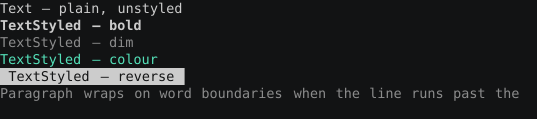

| Widget | Signature | Notes |
|---|---|---|
| `Empty()` | → `Widget` | Renders nothing. Useful as a placeholder. |
| `Text(content)` | `(string) Widget` | Plain text, default style. |
| `TextStyled(content, style)` | `(string, Style) Widget` | Text with explicit style. |
| `FillCh(ch)` | `(rune) Widget` | Fill the area with a single character. |
| `FillChStyled(ch, style)` | `(rune, Style) Widget` | Filled background block. |
| `Paragraph(content)` | `(string) Widget` | Word-wrapped paragraph. |
| `ParagraphStyled(content, style)` | `(string, Style) Widget` | Same with explicit style. |

```gala
TextStyled(s"  Loading… ${pct}%", DefaultStyle().WithBold().WithFg(BrightCyan()))
```

## Layout

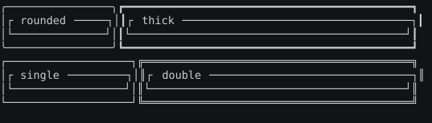

| Widget | Signature | Notes |
|---|---|---|
| `Row(children)` | `(Array[LayoutChild]) Widget` | Horizontal layout solved by Constraint. |
| `Column(children)` | `(Array[LayoutChild]) Widget` | Vertical version of `Row`. |
| `Stack(layers)` | `(Array[Widget]) Widget` | Z-stack — back to front. |
| `Overlay(bottom, top)` | `(Widget, Widget) Widget` | Two-layer alias for Stack. |
| `Padding(n, inner)` | `(int, Widget) Widget` | n-cell padding on all sides. |
| `PaddingHV(v, h, inner)` | `(int, int, Widget) Widget` | Asymmetric padding. |
| `Border(inner)` | `(Widget) Widget` | Default single-line border. |
| `BorderOf(inner, kind)` | `(Widget, BorderKind) Widget` | Pick: `SingleBorder()`, `DoubleBorder()`, `ThickBorder()`, `RoundedBorder()`, `AsciiBorder()`. |
| `Titled(inner, title)` | `(Widget, string) Widget` | Single-line box with a top-left caption. |
| `BorderStyled(inner, kind, style)` | `(Widget, BorderKind, Style) Widget` | Colour the frame itself, independent of its contents. |
| `Block(inner, kind, sides, style, titles)` | `(Widget, BorderKind, BorderSides, Style, Array[BlockTitle]) Widget` | Full form. `AllSides()` / `NoSides()` / `SidesOf(t, r, b, l)` pick edges — a lone left rule is how two panes share one column instead of butting two walls together. Several titles per edge, bucketed by position and alignment. |
| `RowFlex(children, flex, spacing)` | `(Array[LayoutChild], FlexMode, int) Widget` | Distribute slack: `FlexStart` / `FlexEnd` / `FlexCenter` / `FlexSpaceBetween` / `FlexSpaceAround` / `FlexSpaceEvenly`. `FlexLegacy` is the default and matches pre-0.12 behaviour. `ColumnFlex` is the vertical twin. |
| `RowSpaced(children, n)` | `(Array[LayoutChild], int) Widget` | n cells between adjacent children; gaps come out of the axis before the solver runs. |
| `AutoScroll(rows, selected)` | `(Array[Widget], int) Widget` | Stack composed row widgets and scroll so `selected` stays visible. What `SelectList` does, for rows that are more than a label. |

### Rich text

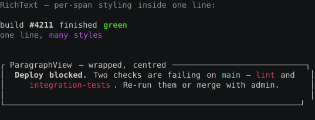

`TextWidget` carries one style for its whole string. `Span` / `Line` /
`RichText` is the three-level model for styling runs within a line.

| Widget | Signature | Notes |
|---|---|---|
| `SpansLine(spans…)` | `(Span…) Widget` | One row of differently-styled runs. |
| `RichTextView(text)` | `(RichText) Widget` | A block of `Line`s, each with its own alignment. |
| `Restyled(inner, f)` | `(Widget, func(Style) Style) Widget` | Render, then rewrite every cell's style in the area — keeps glyphs. This is how a region carries a style. |
| `Highlighted(inner, style)` | `(Widget, Style) Widget` | Flattens the area to `style`. Wins over an outer `.With*`. |
| `Backdrop(inner, bg)` | `(Widget, Color) Widget` | Fills a background only where a cell has not claimed one. |

```gala
SpansLine(
    SpanOf("build "),
    SpanStyled("failed", DefaultStyle().WithFg(BrightRed()).WithBold()),
    SpanOf(" in 2m13s"),
)
```

```gala
Column(ArrayOf[LayoutChild](
    Fixed(3, Border(Text(" header "))),
    Flex(1, Row(ArrayOf[LayoutChild](
        Fixed(20, sidebar),
        Flex(1, body),
    ))),
    Fixed(1, statusBar),
))
```

`LayoutChild` is built with `Fixed(n, w)`, `Flex(weight, w)`, or
`Pct(n, w)`.

## Rect arithmetic

`Rect` is half-open: it covers `X .. X+Width-1`, so `Right()` and `Bottom()`
are one *past* the last cell and `a.Right() == b.X` means the two are
adjacent, not overlapping. Width and height never go negative — an operation
that would shrink past nothing yields an empty rectangle, because a negative
extent read as a huge unsigned one is how a clip turns into a crash.

| Method | Signature | Notes |
|---|---|---|
| `Zero()` | `() bool` | Empty — zero area. |
| `Contains(x, y)` | `(int, int) bool` | Is the cell inside? |
| `Left()` / `Top()` | `() int` | First cell. |
| `Right()` / `Bottom()` | `() int` | One **past** the last cell. |
| `Area()` | `() int` | Cell count. |
| `Inner(margin)` | `(int) Rect` | Shrink every side — the border inset. Too large a margin gives an empty rect, not a negative one. |
| `InnerHV(h, v)` | `(int, int) Rect` | …with separate axes. |
| `Offset(dx, dy)` | `(int, int) Rect` | Move without resizing. |
| `Intersection(o)` | `(Rect) Rect` | Region covered by both; empty when they only touch. |
| `Intersects(o)` | `(Rect) bool` | Do they share a cell? Touching edges do not count. |
| `Union(o)` | `(Rect) Rect` | Smallest rect covering both. An empty operand is ignored rather than dragging the result to its origin. |
| `Clamp(bounds)` | `(Rect) Rect` | Slide inside `bounds`, shrinking only if it cannot fit — what a popup wants near a screen edge. |
| `Centered(w, h)` | `(int, int) Rect` | Centre a `w × h` rect inside, clamped. Odd leftovers go right and down, matching `AlignCenter`. |

```gala
val body = area.Inner(1)                      // inside the border
val popup = area.Centered(40, 8)              // centred, clamped to area
val near  = anchor.Clamp(screen)              // slide a popup back into view
if hit.Intersects(viewport) { ... }           // only if a cell is shared
```

## Canvas

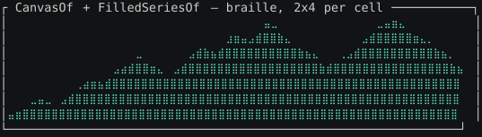

Shapes in your own coordinate space, at sub-cell resolution. Braille packs
2×4 dots per cell, so a 40×10 pane addresses 80×40 points.

| Widget | Signature | Notes |
|---|---|---|
| `Canvas(x, y, marker, shapes)` | `(Bounds, Bounds, CanvasMarker, Array[Shape]) Widget` | Full form. Markers: `BrailleMarker` (2×4), `HalfBlockMarker` (1×2), `DotMarker`, `BlockMarker`. |
| `CanvasOf(x, y, shapes)` | `(Bounds, Bounds, Array[Shape]) Widget` | Braille, the usual choice. |
| `XBounds(min, max)` / `YBounds(min, max)` | `(float64, float64) Bounds` | The caller's coordinate range per axis. |
| `PointsOf(xs, ys, style)` | `(Array[float64], Array[float64], Style) Shape` | Build a series from parallel arrays. |
| `FilledSeriesOf(xs, ys, yRef, style)` | `(Array[float64], Array[float64], float64, Style) Array[Shape]` | An area series: one `ShapeFilledLine` per adjacent pair, filled to `yRef`. |

Shapes: `ShapeLine`, `ShapeFilledLine`, `ShapeRect` (outline), `ShapeCircle`,
`ShapePoints`, `ShapeLabel`. Each carries its own `Style`, so one canvas holds
a dim grid, a bright series and a labelled axis. Only lit cells are written, so
a canvas composes over whatever is beneath it.

`ShapeFilledLine(X1, Y1, X2, Y2, YRef, Style)` is `ShapeLine` plus the band
between it and `YRef` — an area chart. The reference is a coordinate, not "the
bottom", so a series can be filled to a baseline that means something: zero on
an axis that goes negative, a budget line, last run's average. It fills the
same way above and below. Reach for it when the area reads as a quantity
(throughput, bytes, requests) and for a plain `ShapeLine` when it does not (a
temperature, a percentage).

For a whole series, `FilledSeriesOf(xs, ys, yRef, style)` builds the chain —
one segment per adjacent pair, meeting at their shared endpoints with no seam.
It is `PointsOf`'s sibling and takes the shorter of the two arrays for the same
reason:

```gala
CanvasOf(XBounds(0.0, 60.0), YBounds(0.0, maxRps),
         FilledSeriesOf(seconds, rps, 0.0, dim))
```

The `Chart` API has no filled dataset yet — an area series means reaching for
the canvas directly, as above.

Two notes on fills specifically. **Pick a marker that tiles**: braille,
half-block and block all render a fill as solid; `DotMarker` turns one into a
field of `•` that reads worse than the bare line, so keep it for sparse point
series. And the fill and its outline share one `Style` — for a bright edge over
a dim band, draw a `ShapeLine` *after* the `ShapeFilledLine`, since a canvas
cell takes the style of the last shape to light it.

```gala
CanvasOf(XBounds(-1.0, 1.0), YBounds(-1.0, 1.0), ArrayOf[Shape](
    ShapeCircle(X = 0.0, Y = 0.0, Radius = 0.8, Style = accent),
    ShapeLine(X1 = -1.0, Y1 = 0.0, X2 = 1.0, Y2 = 0.0, Style = dim),
    ShapeLabel(X = -0.9, Y = 0.9, Text = "orbit", Style = dim),
))
```

Y grows **up**, as a plot's does — `Y = 0.0` on `YBounds(0.0, 1.0)` is the
bottom row. `YBounds(1.0, 0.0)` genuinely flips that, so a depth or a rank
plots the right way up without negating the data. The degenerate pair is
`Min == Max`: a zero span has no scale to project onto and every shape lands
on one edge. Shapes outside the bounds clip; they do not wrap.

## Charts

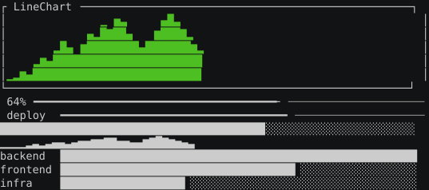

| Widget | Signature | Notes |
|---|---|---|
| `Sparkline(values)` | `(Array[int]) Widget` | One-row bar density. A value at the series minimum floors to the smallest visible block; an *empty* series still renders blank. |
| `SparklineStyled(values, style, dir?)` | `(Array[int], Style) Widget` | …with custom fg/bg. |
| `BarChart(data)` | `(Array[BarChartDatum]) Widget` | Labeled horizontal bars. |
| `LineChart(values)` | `(Array[int]) Widget` | Auto-bounded, sub-cell resolution. |
| `LineChartStyled(values, style)` | `(Array[int], Style) Widget` | Default bounds, explicit style. |
| `LineChartBounded(values, style, bounds)` | `(Array[int], Style, LineChartBounds) Widget` | Explicit `LineChartBounds(Min, Max)`. |
| `LineChartAtHeight(values, style, bounds, rows)` | `(Array[int], Style, LineChartBounds, int) Widget` | Pin the chart to exactly `rows` rows. |
| `MultiLineChart(series, styles)` | `(Array[Array[int]], Array[Style]) Widget` | Overlapping series sharing one Y-axis. |
| `MultiLineChartAtHeight(series, styles, rows)` | `(Array[Array[int]], Array[Style], int) Widget` | Pinned-row variant. |
| `Gauge(percent)` | `(int) Widget` | Horizontal fill bar. Sub-cell precision via partial blocks. |
| `Progress(percent)` | `(int) Widget` | Cell-precise progress bar. |
| `LineGauge(percent)` | `(int) Widget` | One-row gauge captioned with its own percentage: ` 42% ━━━━━━╾──────`. Heavy `━` against light `─` so the split reads without colour, with `╾` where the fill ends mid-cell. Caption is right-aligned in a fixed 4 columns, so the rule's origin holds still as the number grows a digit. |
| `LineGaugeLabeled(label, percent)` | `(string, int) Widget` | Caption of your choosing; `""` gives a bare rule across the row (down to one cell). Too narrow for the caption? The rule takes the row — a clipped caption can read as the wrong number. |
| `LineGaugeStyled(label, percent, filled, unfilled)` | `(string, int, Style, Style) Widget` | Explicit filled/track styles. The caption takes the filled style — it is the value, not chrome. |

```gala
BarChart(ArrayOf[BarChartDatum](
    BarChartDatum(Label = "alice", Value = 12),
    BarChartDatum(Label = "bob",   Value = 7),
))
```

Stacking several `LineGaugeLabeled`s? Captions of different lengths give
every rule a different origin *and* a different length, which is precisely
what stops a column of gauges being comparable by eye. Give the captions a
fixed column of their own instead:

```gala
Row(ArrayOf[LayoutChild](
    Fixed(12, Text("Downloading")),
    Flex(1, LineGaugeLabeled("", pct)),
))
```

**Narrow slots.** Squeezed below its intrinsic width, a widget keeps the part
that still carries information and drops the rest: `ProgressLabeled` drops its
number and keeps the bar, `LineGauge` drops its rule and keeps the caption —
and drops the caption for the rule when the caption would have to be cut. A
*clip* is always signalled (`StringCellEllipsis`'s `…`, `OverflowRow`'s `›`),
because a clipped value can be misread as a shorter one; a *drop* needs no
marker, because an absent rule cannot be mistaken for a short rule.

### Sparkline direction and gaps

`dir` is `SparkLeftToRight()` (default, matches a chart axis) or
`SparkRightToLeft()`, which pins the *first* sample to the right edge so a
fixed-width strip scrolls older data off the left the way a monitor does.

`SparklineOf(values, style, dir?)` takes `Array[Option[int]]`, where `None` is
a sample that does not exist — a dropped scrape, no reading — and renders as a
blank column. That is the one thing `Sparkline` cannot draw: every present
sample floors to `▁` so a run of zeroes still paints a baseline, because
"0 errors in each of the last 40 minutes" is a measurement. Passing `0` for a
missing reading claims one nobody took. An absent sample is also excluded from
the maximum, so a single gap does not rescale the rest of the series.

```gala
SparklineOf(ArrayOf[Option[int]](Some(4), None[int](), Some(4)), style)  // █ █
SparklineOf(ArrayOf[Option[int]](Some(4), Some(0),      Some(4)), style)  // █▁█
```

## Lists & tables

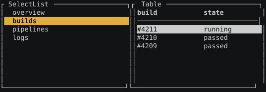

| Widget | Signature | Notes |
|---|---|---|
| `SelectList(items, selected)` | `(Array[ListItem], int) Widget` | Vertical list. Each item carries label + optional hint via `NewListItem(label)`. |
| `SelectListOf(labels, selected)` | `(Array[string], int) Widget` | Convenience over `SelectList` when you only need labels. |
| `Table(data)` | `(TableData) Widget` | Fixed grid; pre-sized columns. |
| `DataTableView(dt)` | `(DataTable) Widget` | Sortable + filterable. State in `DataTable` model — drive with `DataTableUpdate`. |
| `Tree(root)` | `(TreeNode) Widget` | Static collapsible tree. Build with `NewTreeBranch`/`NewTreeBranchExpanded`/`NewTreeLeaf`. |
| `TreeFocused(root, cursor, focused = false)` | `(TreeNode, int, bool) Widget` | Interactive variant — cursor highlight + focus accent. Pair with `TreeFlatRowCount` for clamping and `TreeToggleAt` for expand/collapse. |

```gala
val initial = NewDataTable(
    ArrayOf[string]("Name", "Status"),
    ArrayOf[Constraint](Fill(2), Length(10)),
    ArrayOf[Array[string]](
        ArrayOf[string]("alice", "online"),
        ArrayOf[string]("bob",   "away"),
    ),
)
val dt2 = DataTableUpdate(initial, DTSortBy(0))
RenderTo(DataTableView(dt2), area, buf)
```

## Forms & input

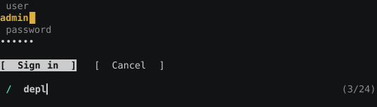

| Widget | Signature | Notes |
|---|---|---|
| `Input(value, cursor, placeholder)` | `(string, int, string) Widget` | Single-line text field; cursor is the **rune index** of the caret, clamped to the value's length. |
| `InputMasked(value, cursor, placeholder)` | `(string, int, string) Widget` | The same field for a secret — one `•` per code point. For another glyph, compose: `Input(MaskValue(v, '*'), cursor, ph)`. |
| `Button(label, focused)` | `(string, bool) Widget` | Reverse style when focused. |
| `FormView(f)` | `(FormState) Widget` | Multi-field form. State in `FormState`. |
| `Spinner(kind, frame)` | `(SpinnerKind, int) Widget` | Pick: `BrailleSpinner()`, `DotsSpinner()`, `PipeSpinner()`, `ArrowSpinner()`. Increment `frame` each tick. |

```gala
val form = NewForm(ArrayOf[FormField](
    FormField(Name = "email", Label = "Email", Required = true),
    FormField(Name = "age",   Label = "Age",   Validator = isNumeric),
))
RenderTo(FormView(form), area, buf)
```

**Passwords.** `Masked` is a field on `FormField`, not a fourth constructor, so
it composes with the three that exist — a required password is
`NewFieldRequired(…).Copy(Masked = true)`, and a validated one is the same
move:

```gala
NewForm(ArrayOf[FormField](
    NewFieldRequired("user", "User", "who"),
    NewFieldRequired("pass", "Password", "").Copy(Masked = true),
))
```

`FormValue` and the field's validator still see what the user typed; only the
drawing changes. The masking happens where the widget is built, not in the
renderer, so the widget tree never holds the secret — which matters in a
library whose trees are meant to be snapshotted, diffed and logged. The cost of
that choice: a reveal toggle can't be a cheap follow-up, because showing the
secret means putting it back in the tree.

Two things a masked field does **not** hide, and one it publishes:

- **The validator's message is drawn verbatim.** The validator is handed the
  plaintext — that is what it validates — so one that quotes what it rejected
  (`'hunter2' is too short`) puts the secret straight back on screen. Describe
  the rule, never the value.
- **The placeholder is drawn verbatim**, because an empty field holds no
  secret. Make it a hint (`at least 12 characters`), not a sample password.
- **The length.** One mask glyph per code point, so the count is visible and
  the layout sizes on it. Every password field does this, and per-keystroke
  feedback is what makes backspace usable. For a constant-width mask, build the
  widget yourself: `Input(MaskValue("········"), …)`.

A reveal toggle is the same composition: `if (reveal) Input(v, …) else
InputMasked(v, …)`.

Per *code point*, not per cell and not per grapheme: matching a wide
character's display width would publish which characters were wide, while a
decomposed `é` draws two bullets. Within a field that stays self-consistent —
one keystroke is one bullet is one backspace — but a pasted secret can show
more bullets than the user expects.

`MaskChar` picks the glyph (`.Copy(Masked = true, MaskChar = '*')`), and
`MaskValue(v, '*')` is the standalone equivalent. The default `•` is East Asian
*Ambiguous*: this library draws it one cell wide, matching xterm, iTerm2 and
Alacritty, but a terminal configured ambiguous-wide gives it two — one column
of error per character, which a long password turns into a smeared frame. `*`
is unambiguously narrow.

## Modals & overlays

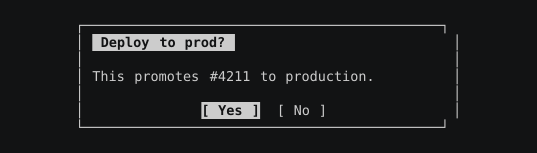

| Widget | Signature | Notes |
|---|---|---|
| `ModalOver(below, w, h, body)` | `(Widget, int, int, Widget) Widget` | Centered panel that **dims the layer beneath** instead of erasing it. The usual choice. |
| `ModalOverStyled(below, w, h, body, border)` | | …with a caller-chosen border. |
| `Modal(w, h, body)` | `(int, int, Widget) Widget` | Centered panel over a backdrop of dim *spaces* — an opaque fill, so whatever was on screen is gone. Use when there is nothing behind worth keeping. |
| `ModalStyled(w, h, body, backdrop, border)` | | Theme-friendly variant of `Modal`. |
| `ConfirmDialog(title, message, yesFocused)` | `(string, string, bool) Widget` | Yes/No prompt. |
| `AlertDialog(title, message)` | `(string, string) Widget` | OK-only prompt. |
| `Dropdown(d)` | `(Dropdown) Widget` | Trigger + open menu. |

```gala
ModalOver(background, 40, 8,
    ConfirmDialog("Deploy?", "This pushes to prod.", true))
```

A modal is a question about the screen that raised it, so the screen should
still be there to look at. `Stack(background, Modal(...))` does not do that: a
widget cannot dim content it was never given, so `Modal`'s backdrop is a fill
of spaces, and a fill of spaces erases. `ModalOver` takes the layer beneath and
restyles it, which is what "dimmed backdrop" was always supposed to mean.

## Status & notifications

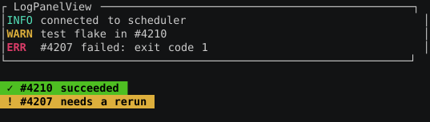

| Widget | Signature | Notes |
|---|---|---|
| `StatusBarView(bar)` | `(StatusBar) Widget` | 3-slot status row (left/center/right). |
| `ToastView(q)` | `(ToastQueue) Widget` | Single toast — most-recent. |
| `ToastStackView(q)` | `(ToastQueue) Widget` | Stack of all queued toasts. |
| `LogPanelView(p)` | `(LogPanel) Widget` | Scrollable log buffer. |
| `LogPanelViewTail(p, n)` | `(LogPanel, int) Widget` | Last n lines only. |

`ToastQueue` and `LogPanel` are pure values — push messages through their
methods, render the result. Both prune on a clock you control.

```gala
val toasts0 = NewToastQueue(5)
val toasts1 = toasts0.PushSuccess("saved", Now(), Seconds(int64(3)))
RenderTo(ToastView(toasts1), area, buf)
```

## Navigation

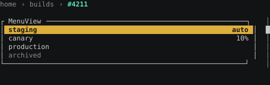

| Widget | Signature | Notes |
|---|---|---|
| `MenuView(m)` | `(Menu) Widget` | Vertical or horizontal menu — set `Menu.Orientation`. |
| `DropdownView(d)` | `(Dropdown) Widget` | Closed = trigger; open = menu below. |
| `Tabs(titles, bodies, selected)` | `(Array[string], Array[Widget], int) Widget` | Tabbed pane — bodies parallel to titles. |
| `Scrollbar(total, visible, offset)` | `(int, int, int) Widget` | Vertical scroll-thumb track on the right edge. Pass `visible = 0` to derive the viewport from the bar's own area. With nothing to scroll it draws track only, not a full thumb. |
| `ScrollbarStyled(total, visible, offset, style)` | `(int, int, int, Style) Widget` | …with explicit fg/bg. |
| `ScrollbarAt(total, visible, offset, style, orientation)` | `(int, int, int, Style, ScrollbarOrientation) Widget` | Pick the edge: `ScrollbarVerticalRight` / `…Left` / `ScrollbarHorizontalBottom` / `…Top`. |
| `ScrollableViewport(inner, offset, contentHeight)` | `(Widget, int, int) Widget` | Vertically scroll a tall widget; clip to the area. |

## Markdown & code

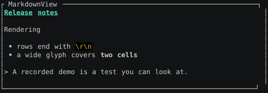

| Widget | Signature | Notes |
|---|---|---|
| `MarkdownView(source)` | `(string) Widget` | Headings, bold/italic/code, lists, links, fenced blocks. |
| `HighlightLine(line, lang)` | `(string, string) Widget` | Single-line syntax highlight. Supports gala / go / rust / python / shell. |
| `Link(label, url)` | `(string, string) Widget` | OSC 8 hyperlink — clickable in modern terminals. The url rides on the cell's `Style`; the escape is emitted by the buffer writer at the run's boundaries, so the widget's width is the label's width. |
| `HyperlinkText(label, url)` | `(string, string) Widget` | Same as `Link` with a blue default. Prefer `Link` in new code. |
| `Linked(inner, url)` | `(Widget, string) Widget` | Makes a whole composed widget one clickable target — a bordered card, a table row — not just a string. |

```gala
MarkdownView("# Quick start\n\nRun `gala build .` then **enjoy**.")
```

## Compact chrome widgets

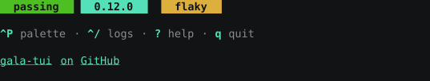

Small composable building blocks for headers / footers / status rows.
Each is a thin wrapper over `Text`/`Row` primitives, pulled out so apps
don't re-derive the formatting every time.

| Widget | Signature | Notes |
|---|---|---|
| `Breadcrumb(parts, separator = " › ")` | `(Array[string], string) Widget` | Segment trail. Last segment bright-cyan + bold; earlier segments dim. Empty input → `Empty()`. |
| `BreadcrumbStyled(parts, separator, inactive, active)` | `(..., Style, Style) Widget` | Caller-picked styles per segment. |
| `Tag(label, color)` | `(string, Color) Widget` | Reverse-styled `[label]` status pill. |
| `TagPlain(label, color)` | `(string, Color) Widget` | Flat `[label]` without reverse — for contexts where reverse would clash with row highlight. |
| `KeyHint(spec, description)` | `(string, string) Widget` | Inline `Ctrl+P palette` keybind label — bright-cyan spec, dim description. |
| `KeyHintRow(pairs)` | `(Array[string]) Widget` | Joins `(spec, description)` pairs with ` · ` separators — the canonical bottom-of-screen shortcut strip. |

```gala
val footer = KeyHintRow(ArrayOf[string](
    "Ctrl+P", "palette",
    "Tab",    "cycle focus",
    "q",      "quit",
))
val crumbs = Breadcrumb(ArrayOf[string]("App", "Builds", "#4211"))
val beta = Tag("Beta", BrightYellow())
```

## Status indicators

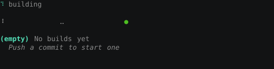

Transient app state widgets — pair with a `TickSub` so the animation
phases advance.

| Widget | Signature | Notes |
|---|---|---|
| `Loader(text, frame)` | `(string, int) Widget` | "⠋ Loading…" — bright spinner + dim label. |
| `LoaderStyled(text, frame, kind, spinStyle, textStyle)` | | Caller-picked spinner kind + colours. |
| `EmptyState(icon, text)` | `(string, string) Widget` | "📭 No items yet" placeholder; bright icon + dim text. |
| `EmptyStateHinted(icon, text, hint)` | `(string, string, string) Widget` | …plus a dimmed italic hint line below. |
| `Pulse(frame, color)` | `(int, Color) Widget` | " ● " dot pulsing on a 2-phase clock. |
| `PulseFrames(frame, color)` | `(int, Color) Widget` | " ● " dot with a 4-phase fade — smoother. |

```gala
val sub = TickSub[Msg](Interval = Milliseconds(int64(120)),
                       Make = () => Tick())
// ...
val view = Column(ArrayOf[LayoutChild](
    Fixed(1, Loader("Fetching builds…", m.Tick)),
    Fixed(1, Pulse(m.Tick, BrightGreen())),    // "live" indicator
    Fixed(2, EmptyStateHinted("📭", "No matches", "Press / to filter")),
))
```

## Search + diff

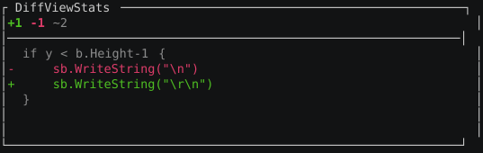

| Widget | Signature | Notes |
|---|---|---|
| `SearchInput(query, matched, total)` | `(string, int, int) Widget` | `/  query… (12/45)` — icon + input + result-count badge. Empty query collapses the badge. |
| `SearchInputStyled(query, matched, total, iconStyle, textStyle, badgeStyle)` | | …with caller-picked styles. |
| `MatchSubstring(haystack, needle)` | `(string, string) bool` | Case-insensitive substring predicate, the canonical SearchInput filter. |
| `DiffView(lines)` | `(Array[DiffLine]) Widget` | Line-by-line diff: green `+` for added, red `-` for removed, dim ` ` for context. Empty input → "(no changes)". |
| `DiffViewStats(lines)` | `(Array[DiffLine]) Widget` | DiffView prefixed with a `+N -M ~K` summary row. |

```gala
sealed type DiffLine {
    case DiffContext(Text string)
    case DiffAdded(Text string)
    case DiffRemoved(Text string)
}

val hits = items.Filter((s) => MatchSubstring(s, m.Query))
val view = Column(ArrayOf[LayoutChild](
    Fixed(1, SearchInput(m.Query, hits.Length(), items.Length())),
    Flex(1, SelectListOf(hits, m.Sel)),
))
```

## Themed helpers

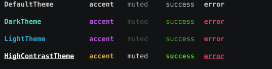

These pick fg/bg/border from a `Theme` so you don't have to wire each
widget by hand.

| Widget | Signature |
|---|---|
| `HeadingT(theme, content)` | `(Theme, string) Widget` |
| `AccentT(theme, content)` | `(Theme, string) Widget` |
| `SuccessT(theme, content)` | `(Theme, string) Widget` |
| `WarningT(theme, content)` | `(Theme, string) Widget` |
| `ErrorT(theme, content)` | `(Theme, string) Widget` |
| `MutedT(theme, content)` | `(Theme, string) Widget` |
| `BorderT(theme, inner)` | `(Theme, Widget) Widget` |
| `BackgroundT(theme, inner)` | `(Theme, Widget) Widget` |

Built-in themes: `DefaultTheme()`, `DarkTheme()`, `LightTheme()`,
`HighContrastTheme()`. Roll your own with the `Theme` struct directly.

## Hit-testing & domain helpers

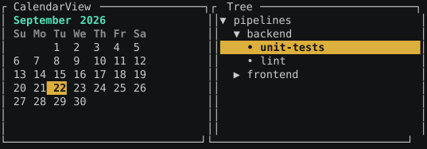

| Widget | Signature | Notes |
|---|---|---|
| `CalendarView(c)` | `(Calendar) Widget` | One-month grid + cursor. |
| `FileBrowserView(b)` | `(FileBrowser) Widget` | Directory listing + breadcrumb. |
| `HelpView(entries)` | `(Array[HelpSpec[T]]) Widget` | Auto-formatted shortcut sheet. |
| `HelpModalView(entries, w, h)` | `(Array[HelpSpec[T]], int, int) Widget` | Centered modal version. |
| `PaletteView(p)` | `(Palette[T]) Widget` | Command-palette body. |
| `PaletteViewAtHeight(p, max)` | `(Palette[T], int) Widget` | Same, capped. |

## Snapshots

For tests, use `Snapshot(widget, w, h)` to render to a plain string and
compare against a fixture. See [GETTING_STARTED.md](GETTING_STARTED.md)
§ 5 for an example.

| Function | Returns |
|---|---|
| `Snapshot(w, w, h)` | `string` (no ANSI) |
| `SnapshotStyled(w, w, h)` | `string` (full ANSI for color assertions) |
| `SnapshotLines(w, w, h)` | `Array[string]` (one line per row) |
| `SnapshotsEqual(got, want)` | `bool` |
| `SnapshotDiff(got, want)` | `Option[string]` (human-readable diff) |

## Inline viewport

By default an app owns the whole terminal on the alternate screen. That is
wrong for a TUI that is part of a command rather than the whole session — a
progress view, a picker, a confirmation — because leaving the alternate
screen erases everything the app displayed.

`InlineBackend(height)` renders into `height` rows directly below the shell
prompt and leaves the final frame on screen when the program exits:

```gala
val _ = RunWithSub[Model, Msg](program, keyToMsg, sub, InlineBackend(5))
```

The viewport is positioned relatively throughout, so the app coexists with
whatever is already on screen and never writes above its own block.

| | `TerminalBackend()` (default) | `InlineBackend(n)` |
|---|---|---|
| Screen | alternate | normal, `n` rows below the prompt |
| Size | whole terminal | terminal width × `n` |
| Repaint | diffed against the previous frame | full |
| On exit | screen restored, output gone | final frame stays in scrollback |

Repaints are full rather than diffed: an inline viewport is a handful of
rows, so the bandwidth argument for diffing does not apply, and a diff in
relative cursor moves is much easier to get wrong than to make fast.

### Printing above the viewport

`PrintAbove(lines…)` is a `Cmd` that puts lines into the scrollback *above*
the viewport, where they stay after the app exits — one line per finished
target while a live progress block stays pinned below it:

```gala
func update(m Model, msg Msg) Tuple[Model, Cmd[Msg]] = msg match {
    case TargetDone(name, ms) =>
        (m.Advance(), PrintAbove[Msg](s"✓ ${name} in ${ms}ms"))
    ...
}

// …and it needs the inline backend — the default is the alternate screen.
val _ = RunWithSub[Model, Msg](program, keyToMsg, sub, InlineBackend(3))
```

Writing to stdout yourself cannot do this: the viewport is drawn relative to
the cursor, so a stray write lands inside the frame and the next paint
overwrites it. Going through a `Cmd` also keeps `update()` pure, so a test
asserts the lines with `NewTestBackend` instead of a terminal.

A line printed alongside `QuitCmd` in the same `Batch` still lands — an app
whose last act is to print a summary and exit means both, and the viewport is
repainted on the way out so the final frame survives in the scrollback below
it. On the full-screen backend the lines are dropped: the alternate screen has
no scrollback to insert into, which is the same limitation ratatui's
`insert_before` has.

Each element is one row — with one exception worth knowing. A string carrying
its own `\n` is split, because in raw mode a bare newline moves down without
returning to column 0 and the text after it would land mid-row. But a printed
line is the one string in this library that does **not** go through the cell
model: it is handed to the terminal as bytes, unmeasured, so a line wider than
the terminal soft-wraps and silently takes two rows. That is safe — the
viewport's rows are blanked before the lines land, so a wrapped line cannot
weld the old frame's tail onto its continuation row — but it is a silent clip
of the one-row rule, not a signalled one. Measuring is not available here:
`StringCellWidth` counts a line's own SGR escapes as cells, and truncating one
can cut mid-escape. A caller who needs one row per element fits the text
itself.

## Testing a run loop without a terminal

`NewTestBackend(width, height, input)` scripts stdin and records everything
written, so the whole loop — parsing, carry-over, click resolution, quit
handling, teardown — can be driven from a test:

```gala
val (backend, st) = NewTestBackend(40, 3, "abc")
val final = Run[Model, Msg](program, keyToMsg, backend)
IsTrue(t, st.Wrote("keys=a,b,c"))
```

`Read` reports end-of-input once the script runs out, so a scripted run
terminates on its own instead of needing a Quit in every fixture.

Use `NewTestBackendChunks(width, height, chunks)` when the split between
reads matters — an escape sequence torn across two reads cannot be expressed
as a single string, because one string always arrives in one read.
